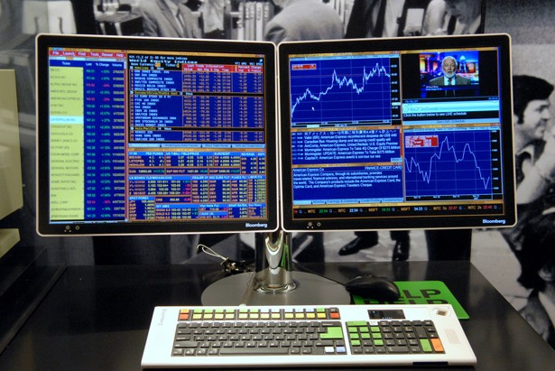

# Tradist: A Financial Visualization and Portfolio Tracking Service

### Overview

[Tradist](https://github.com/K2GFA/Tradist) allows users to access historical financial data for a select set of key commodities, indices and equities.  Users can sign up for accounts and via JWT authentication, gain access to our data set through an API.  We also provide a visual interface on our app's front end, with a variety of charts available to investigate correlations.

The team behind Tradist created it as our third project for General Assembly's Web Development Immersive in Singapore (SG-WDI2).  We come from a variety of backgrounds but share an interest in financial markets and investing.  While some of us have worked with Bloomberg terminals in past jobs (previous lives) and other financial software, we'd like to create something simple, accessible and free for the community at large.

We hope you'll enjoy using our app! :)

~ [Charles](https://github.com/charlesguo), [Firus](https://github.com/firusfaizal), [Hakim](https://github.com/hakimishere), [KT](https://github.com/khoodose) and [Leok Si](https://github.com/leokleok)

### Technologies Used
- Mongoose
- MongoDB
- Express
- Node.js
- Notable Node Packages:
    - bcrypt
    - express-jwt
    - node-mongo-seeds (hellz yeah)
- jQuery
- Bootstrap for CSS Styling
- Plotly JavaScript library for charting

### Approach Taken
- We used a [Trello](https://trello.com/b/RJaWATkd/project-3-api) board to chart out our main idea, user stories, and also store the seed CSV financial data
- We used publicly available data sources like Yahoo and the St. Louis Fed's FRED site
- We formatted the data and used CSV to JSON converters to format our data and seed our database
- We looked for suitable charting libraries and decided on [Plotly](https://plot.ly/javascript/)
- We planned our workflows together and took turns at pair programming, which proved to be really useful
- The project gave us a useful overview and recap of:
    - How to set up an API, including restful routes and what to return
    - Data visualization
    - User authentication using JWT
    - Integrating and merging team changes (always "interesting")

### Usage Instructions
- Users need to be logged in to either retrieve data through our API or use our visual interface

- Upon creating accounts, users can either access our API and perform CRUD actions through Postman or Curl
- Users can also check out our data visualization service, enabled by Plotly's JavaScript library
- Where applicable, users are able to select the tickers they would like charted through our dropdown menus on the relevant pages

### Future Development
- Social logins
    - Users can be authenticated through Facebook/Twitter/Google logins, which will also allow them to share their portfolios more easily
- Taking in live data from other sites (both consume and serve data through APIs)
